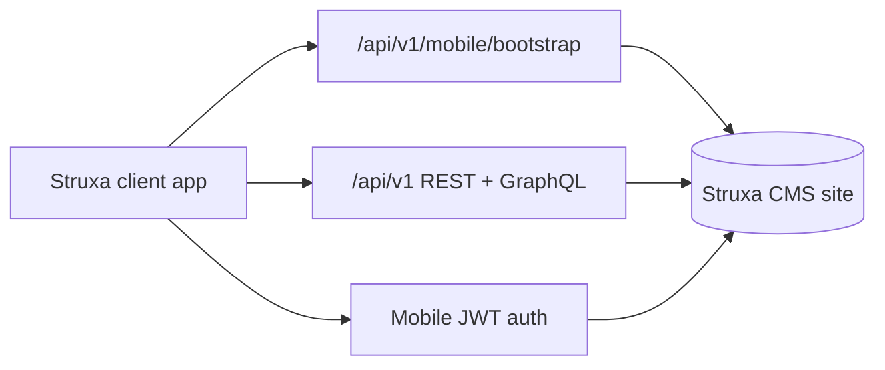

# Struxa mobile app — phased roadmap

One **Struxa client app** (Expo/React Native). Users add site URL(s); each site is independent and loads branding, content, and commerce from that installation.

## Phase 1 — CMS bootstrap (done)

**Goal:** Sites advertise themselves to the client app.

- `GET /api/v1/mobile/bootstrap`
- `GET /.well-known/struxa.json`
- `MobileSettings` + `MobileBootstrapService`
- Admin **Site → Mobile app**
- Plugin filter `mobile.bootstrap`
- Docs: [mobile.md](mobile.md)

**Deliverable:** App can fetch site name, colors, logo, tabs, nav, content types, feature flags.

---

## Phase 2 — Expo app shell (done)

**Goal:** Minimal client that connects to real sites.

- Site registry (add / remove / switch URLs)
- Bootstrap fetch + cache per site
- Apply theme (accent, logo, site name)
- Tab bar from bootstrap `mobile.tabs`
- Placeholder screens per tab type (home, browse, shop)

**Location:** `mobile-app/` in this repository.

**Deliverable:** User enters `https://yoursite.com`, sees branded shell with tabs.

See [mobile-app/README.md](../mobile-app/README.md) for run instructions.

---

## Phase 3 — Read-only content (done)

**Goal:** Browse published content in the app.

- Public mobile content API (no API key): `GET /api/v1/mobile/content/{typeSlug}/entries` and `.../entries/{entrySlug}`
- Published entries only; reuses `PublicContentApi` detail shape + `API_ENTRY_RESPONSE` filter
- App: content type list → entry list (pagination) → entry detail with featured images

**Deliverable:** Blog/products/content types readable in app.

---

## Phase 4 — Mobile JWT auth (done)

**Goal:** End-user login per site without session cookies.

- `POST /api/v1/mobile/auth/login|register|refresh|logout`
- `GET /api/v1/mobile/auth/me` (Bearer access token)
- Short-lived JWT access tokens + hashed refresh tokens in `cms_mobile_refresh_tokens`
- Per-site sessions in the app (AsyncStorage keyed by site id)
- TOTP support on login when enabled for CMS staff accounts

**Deliverable:** User signs in on Site A without affecting Site B.

---

## Phase 5 — Commerce in app (done)

**Goal:** Browse catalog and checkout.

- Product list/detail JSON APIs (or extend REST)
- Cart + Stripe Payment Sheet / Checkout deep links
- Order history for logged-in customers
- Digital delivery links (Phase 7 CMS fulfillment)

**Deliverable:** Purchase flow on a Struxa commerce site from the app.

**CMS:** `GET /api/v1/mobile/commerce/products`, product detail, cart quote, Stripe checkout URL, order list/detail (JWT).

**App:** Shop tab with product browse, local cart, Stripe Checkout in browser, order history on Account tab.

---

## Phase 6 — Polish & growth (done)

**Goal:** Operator tools and extensibility.

- Admin QR code → “Add this site to Struxa app”
- Richer tab / screen config in admin
- Plugin mobile widgets (custom tab types, screens)
- Push notifications (optional, per site)
- App Store / Play Store release

**Deliverable:** Operators can onboard app users via QR; tabs support content scoping, external links, and plugin screens.

**CMS:** `/mobile/add` landing page, `/mobile/add/qr.svg`, bootstrap `add_site_deeplink`, extended tab JSON fields.

**App:** Deep link handler (`struxa://add-site`), `link`/`plugin` WebView tabs, content tabs with `content_type_slug`, [RELEASE.md](../mobile-app/RELEASE.md) for store builds.

**Deferred:** Push notifications (documented in RELEASE.md).

---

## Phase 7 — Digital delivery (done)

**Goal:** Post-purchase downloads in the app.

- List active digital grants for logged-in customers (JWT)
- Order detail includes `digital_downloads` with secure access URLs
- Reuses CMS `cms_commerce_digital_grants` and `/commerce/access/{token}` delivery

**Deliverable:** Customers open downloads from the Account tab after buying digital products.

**CMS:** `GET /api/v1/mobile/commerce/downloads`, grants on order detail.

**App:** Downloads list + per-order download buttons (opens browser for file/url/entry delivery).

---

## Architecture sketch

## Principles

1. **Multi-site:** One app, many URLs; no hard-coded tenant.
2. **No secrets in the app:** Bootstrap is public; writes need auth.
3. **Reuse CMS:** Branding from site settings + theme; content from existing APIs where possible.
4. **Plugins:** Use `mobile.bootstrap` and future hooks to extend without forking the app.
