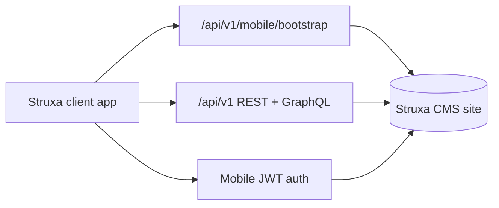

# Struxa mobile app — phased roadmap

One **Struxa client app** (Expo/React Native). Users add site URL(s); each site is independent and loads branding, content, and commerce from that installation.

## Phase 1 — CMS bootstrap (done)

**Goal:** Sites advertise themselves to the client app.

- `GET /api/v1/mobile/bootstrap`
- `GET /.well-known/struxa.json`
- `MobileSettings` + `MobileBootstrapService`
- Admin **Site → Mobile app**
- Plugin filter `mobile.bootstrap`
- Docs: [mobile.md](mobile.md)

**Deliverable:** App can fetch site name, colors, logo, tabs, nav, content types, feature flags.

---

## Phase 2 — Expo app shell (done)

**Goal:** Minimal client that connects to real sites.

- Site registry (add / remove / switch URLs)
- Bootstrap fetch + cache per site
- Apply theme (accent, logo, site name)
- Tab bar from bootstrap `mobile.tabs`
- Placeholder screens per tab type (home, browse, shop)

**Location:** `mobile-app/` in this repository.

**Deliverable:** User enters `https://yoursite.com`, sees branded shell with tabs.

See [mobile-app/README.md](../mobile-app/README.md) for run instructions.

---

## Phase 3 — Read-only content (done)

**Goal:** Browse published content in the app.

- Public mobile content API (no API key): `GET /api/v1/mobile/content/{typeSlug}/entries` and `.../entries/{entrySlug}`
- Published entries only; reuses `PublicContentApi` detail shape + `API_ENTRY_RESPONSE` filter
- App: content type list → entry list (pagination) → entry detail with featured images

**Deliverable:** Blog/products/content types readable in app.

---

## Phase 4 — Mobile JWT auth

**Goal:** End-user login per site without session cookies.

- New endpoints: login, register, refresh, logout issuing **JWT** (or opaque mobile tokens)
- Per-site user accounts (existing PHPAuth users)
- Optional Google SSO deep link flow
- Protected routes: profile, orders, comments

**Do not:** Rely on PHPAuth session cookies or CSRF from the app.

**Deliverable:** User signs in on Site A without affecting Site B.

---

## Phase 5 — Commerce in app

**Goal:** Browse catalog and checkout.

- Product list/detail JSON APIs (or extend REST)
- Cart + Stripe Payment Sheet / Checkout deep links
- Order history for logged-in customers
- Digital delivery links (Phase 7 CMS fulfillment)

**Deliverable:** Purchase flow on a Struxa commerce site from the app.

---

## Phase 6 — Polish & growth

**Goal:** Operator tools and extensibility.

- Admin QR code → “Add this site to Struxa app”
- Richer tab / screen config in admin
- Plugin mobile widgets (custom tab types, screens)
- Push notifications (optional, per site)
- App Store / Play Store release

---

## Architecture sketch

## Principles

1. **Multi-site:** One app, many URLs; no hard-coded tenant.
2. **No secrets in the app:** Bootstrap is public; writes need auth.
3. **Reuse CMS:** Branding from site settings + theme; content from existing APIs where possible.
4. **Plugins:** Use `mobile.bootstrap` and future hooks to extend without forking the app.
